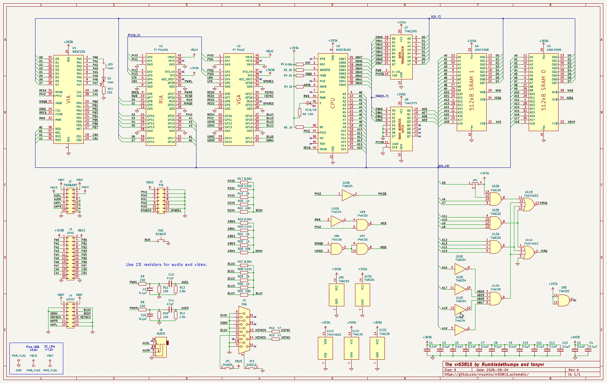
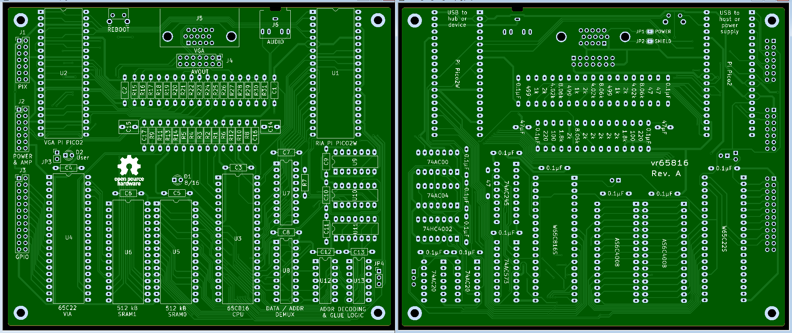

# vr65816
WDC 65C816 Single Board Computer compatible with [Rumbledethump's Picocomputer Architecture](https://picocomputer.github.io/)

## Goals
- Use 2 [RasberryPi Pico2s](https://www.raspberrypi.com/products/raspberry-pi-pico-2/) with [Rumbledethumps' rp6502 firmware](https://github.com/picocomputer/rp6502)
- Run [WDC 65C816](https://www.westerndesigncenter.com/wdc/documentation/w65c816s.pdf) at up to 8Mhz, clocked by Pico2W RIA
- Use currently produced through-hole ICs only, and no programmable logic
- Use 1MB SRAM, 64kB extended RAM (on Pico2W RIA), and no hardware ROM
- Use [WDC 65C22](https://www.westerndesigncenter.com/wdc/documentation/w65c22s.pdf) for timers and peripheral I/O
- Use [KiCad](https://www.kicad.org/download) to create fully open source schematic and board source files
- Run all existing apps and games ("[ROMs](https://discord.com/channels/534571197908647946/1487969279251841216)") for the Rumbledethumps' RP6502 Picocomputer
- Enable [creation](https://github.com/picocomputer/rp6502-sdk) of new "ROMs" utilizing [advanced features and memory of the '816](https://archive.org/details/0893037893ProgrammingThe65816/mode/2up) 

## Getting a PCB
I used [PCBWay](https://www.pcbway.com/Member/Login/) to fabricate my PCB:
- Click on "PCB Prototype" at upper left after logging in
- Enter Length=125 and Width=150 mm for the Size
- Select Quantity desired (5 minimum)
- Select Solder Mask and Silkscreen Colors, Surface Finish, and 'Remove Product No.' as desired
- Press the Calculate button at the bottom to generate a price quote
- If the price is right, press 'Save to Cart', then 'Agree' buttons
- Drag the vr65816_gerbers.zip file into the web dialog, then click 'Submit the file now'

After a wait of a few minutes while the file is 'Under Review' you be allowed to place your order

My cost was about $90 USD including shipping, fees, and taxes -- about $18 USD per PCB

## Getting the rest of the Parts

I used [Mouser's 'Create a BOM'](https://www.mouser.com/en/help/tools/how-to-create-a-new-bom) feature to order all the other parts.  Use the 'Mouser Part Number' and 'Qty' columns from the vr65816_full_BOM.csv file in this repository

My cost per kit of parts was about $114 USD, including shipping, fees, and taxes.

The total price therefore came out to be about $132 on 9/6/20126, in Silicon Valley, USA.
